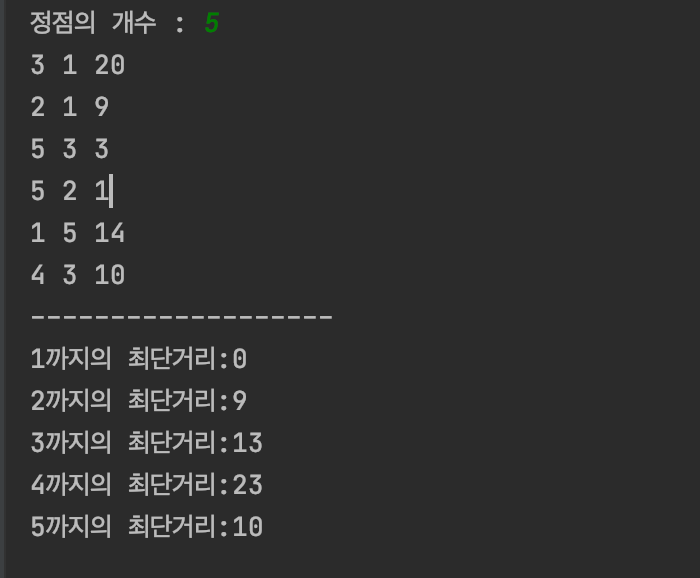

## 최단 경로(Shortest Path) 문제
주어진 가중치 그래프에서 어느 한 출발점에서 또 다른 도착점까지의 최단 경로를 찾는 문제이다.


### 최단 경로를 찾는 알고리즘 - 다익스트라(Dijkstra)
 - 특정한 하나의 정점에서 다른 모든 정점으로 가는 최단 경로
 - 최단 거리는 여러 개의 최단 거리로 이루어져 있음
 - 하나의 최단 거리를 구할 때 그 이전까지 구했던 최단 거리 정보를 그대로 사용
 - 현재까지 알고있던 최단 경로를 계속해서 갱신


### 작동 과정
  1. 출발 노드를 설정
  2. 출발 노드를 기준으로 각 노드의 최소 비용을 저장
  3. 방문하지 않은 노드 중 가장 비용이 적은 노드 선택
  4. 해당 노드를 거쳐서 특정한 노드로 가는 경우를 고려하여 최소 비용을 갱신
    <br> ex. 1-> 4-> 3 : 4, 1-> 3 : 5 일때 4가 5보다 작으므로 4로 갱신
         <br>   1-> 4-> 5-> 3 : 3 이면 또 최소이므로 갱신
  5. 3~4번을 반복 


### Shortest Path(G,V)
입력 : 가중치 그래프 G(V,E), |V|=n, |E|=m

출력 : 출발점 s로부터 (n-1)개의 점까지 각각 최단 거리를 저장한 배열 D

1. 배열 D를 infinite로 초기화. 단, D[s]=0으로 초기화
2. while(s로부터의 최단 거리가 확정되지 않은 점이 있으면) {
3. 현재까지의 s로부터 최단 거리가 확정되지 않은 각 점 v에 대해서 최소의 D[v]의 값을 가진 점 vmin을 선택하고, 출발점 s로부터 점 vmin까지의 최단 거리 D[vmin]을 확정한다.
4. s로부터 현재보다 짧은 거리로 점 vmin을 통해 우회 가능한 각 점w에 대해서 D[w]를 갱신한다.}
5.  return D


 <br> 최단 경로를 다익스트라 알고리즘 이용 시
 <br> 서울->천안->원주->논산->대전->대구->광주->부산->포항->


### 시간 복잡도

##### while-루프가 (n-1)번 반복되고, 1회 반복

  따라서 (n-1) * {O(n) + O(n)} = O(n^2) 


## -코드설명-
<hr/>


### Graph의 필드와 메서드

```
    class Graph{
    private int n;
    private int maps[][];

    public int[][] getMaps(){
        return maps;
    }

    Graph(int n){
        this.n = n;
        maps = new int[n+1][n+1];
    }

    void input(int i, int j, int v){
        maps[i][j] = v;
        maps[j][i] = v;
    }
  ```


### weight와 방문 배열 초기화

```
    // 간선의 weight를 나타내는 배열 dist와 방문 표시 배열 check 초기화
    public void dijkstra(int v){
        int dist[] = new int[n+1];
        boolean check[] = new boolean[n+1];

        for(int i =1; i< n+1; i++){
         dist[i] = Integer.MAX_VALUE;
        }
        dist[v] = 0;
        check[v] =true;

        for(int i = 1; i< n+1; i++){
            if(!check[i] && maps[v][i] !=0){
                dist[i] = maps[v][i];
            }
        }
```


### 정점 방문하면서 최단거리 찾기

```
 for(int a = 0; a < n-1; a++){
            int min = Integer.MAX_VALUE;
            int min_index = -1;

            //최소값 찾기
            for(int i = 1; i < n+1; i++){
                if(!check[i] && dist[i] != Integer.MAX_VALUE){
                    if(dist[i] < min){
                        min = dist[i];
                        min_index = i;
                    }
                }
            }

            check[min_index] = true;
            for(int i = 1; i < n+1; i++){
                if(!check[i] && maps[min_index][i] != 0){
                    if(dist[i] > dist[min_index] + maps[min_index][i]){
                        dist[i] = dist[min_index] + maps[min_index][i];
                    }
                }
            }
        }
        
```


### 최단거리 출력 

```
  for(int i =1 ;i < n+1; i++){
            System.out.println(i+"까지의 최단거리:"+dist[i]);
        }
        System.out.println("");
    }
```


### main

```
   public static void main(String args[]){
        Scanner sc = new Scanner(System.in);
        Random rand = new Random();

        System.out.print("정점의 개수 : ");
        int n = sc.nextInt();
        Graph g = new Graph(n);
        
        int t = (n-1)+rand.nextInt(10);
        int maps[][] = new int[n+1][n+1];
        int cnt[] = new int[n+1];

        //노드에 weight  넣기
        for(int k =0; k<= t; k++){
            int i =rand.nextInt(n)+1, j = rand.nextInt(n)+1, v= rand.nextInt(20)+1;
            maps = g.getMaps();

            while(maps[i][j] == 0 && i != j) {
                System.out.println(i + " " + j + " " + v);
                cnt[i]++; cnt[j]++;
                g.input(i, j, v);
            }
        }

        //간선이 없는 노드가 존재할 경우
        for(int i=1; i < n+1; i++){
            if(cnt[i] == 0){
                int j = rand.nextInt(n)+1;

                while(i == j){
                    j = rand.nextInt(n)+1;
                }

                int w = rand.nextInt(10)+1;
                System.out.println(i + " " + j + " " + w);
                g.input(i, j, w);

            }
        }

        System.out.println("-------------------");
        g.dijkstra(1);
        
    }
```


### 결과


> 연결할 노드들을 입력하고 각각의 weight를 입력해준다.
> 시작점 1번 노드부터 다익스트라 알고리즘을 수행한 후 최단거리를 출력한다. 

